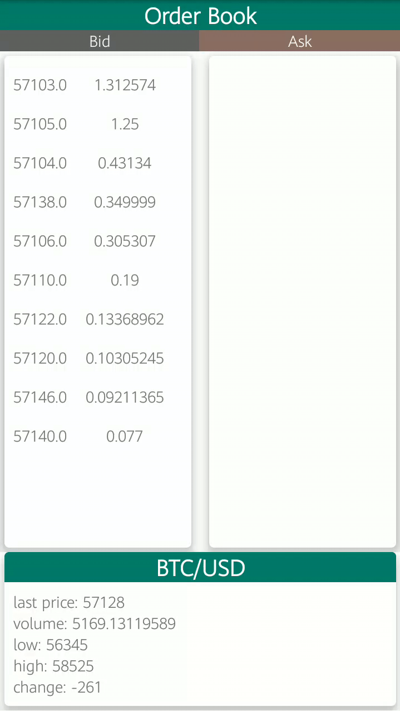

# ScarletBitfinexSocket-RxJava

This app is an <b>open-source</b> application based on <b>Clean Architecture</b> for implementing a sample of WebSocket with RxJava and RxAndroid.

In this project, the following capabilities have been used:

<td align="center"> </td>

<td align="center"> </td>

## Features

Currently the following functions are implemented:

* Scarlet WebSocket library
* Clean Architecture(Modular)
* MVVM Design Pattern
* RxJava and RxAndroid
* Dependency Injection with <b>dagger Hilt</b>
* Kotlin DSL for dependencies

## Developed with love and passion by

* Saeed Noshadi - Email: (SaeedNoshadi89@gmail.com, Saeed.dev68@gmail.com)

                                         GNU GENERAL PUBLIC LICENSE
                                           Version 3, 29 June 2007
                   
